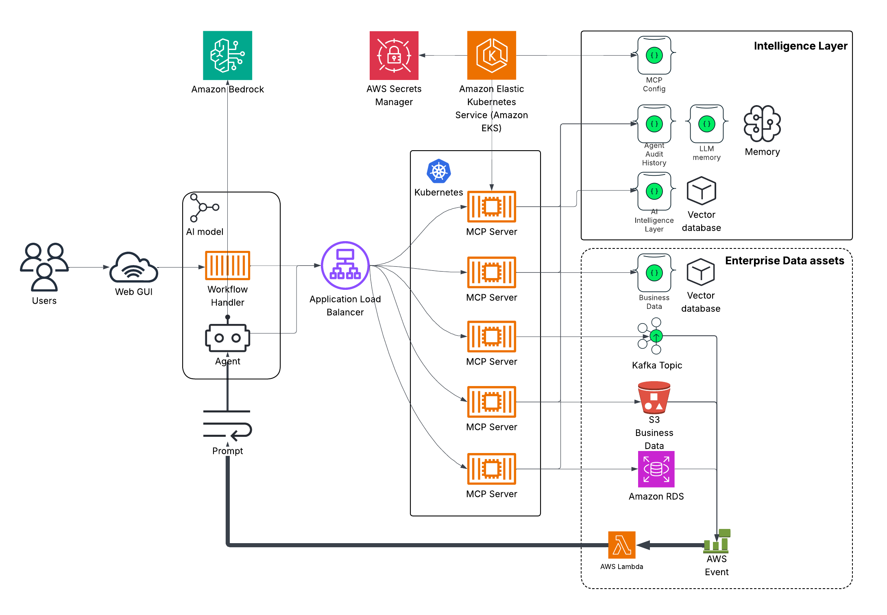

# Dynamic MongoDB MCP Server

A configurable Model Context Protocol (MCP) server that dynamically loads tool configurations from MongoDB. Includes a Web UI agent frontend backed by MongoDB Grove.



## Architecture

```
webui/          Flask + React frontend, talks to MCP server over HTTP
mongo_mcp.py    FastMCP server exposing MongoDB tools via HTTP
mongomcp/       Core package: server, middleware, auth, Grove LLM client, cache
mongomcp/agent/ Web UI subpackage: CachedQueryProcessor, ToolRouter, WebUiGroveClient
```

## Prerequisites

- Python 3.10+
- Docker (for container targets)
- AWS credentials in `~/.aws/` (Secrets Manager, optional for local dev)
- MongoDB Atlas cluster with an MCP config collection and target data collection(s)


## Required Local Settings

Before running the local setup, update the hardcoded MongoDB credentials in `local_settings.py`:

```python
self._credentials = {
    "username": "your_mongodb_username",
    "password": "your_mongodb_password",
    "mongoUrl": "your_cluster.mongodb.net"
}
```

This value must be set in both places:

- `MongoMCP/local_settings.py`
- `MongoMCP/webui/local_settings.py`

Both `local_settings.py` files must point at the same MongoDB cluster. Run `scripts/local-setup.sh` (or `tools/generate_jwt_token.py`) to create a local agent identity and print an `AUTH_TOKEN` line for `.env` / `webui/local_settings.py`.

Run the setup scripts below after setting credentials. You will see an output line in this format:

```bash
AUTH_TOKEN = "..."
```

## Quick Start

```bash
# 1. Create and activate a virtual environment
python -m venv .
source bin/activate

# 2. Install the MCP server package
pip install -e ./mongomcp

# 3. Install top-level dependencies
pip install -r requirements.txt

# 4. Local setup: agent identity, dataset indexes, and MCP_AUTH_TOKEN in .env
bash scripts/local-setup.sh

# 5. Run the MCP server
fastapi run mongo_mcp.py --port 8000

# 6. In a separate terminal install the webui
pip install -e "./mongomcp[agent]"
pip install -r webui/requirements.txt

# 7. Build the front end
cd webui/frontend
npm install
npm run build

# 8. in the webui dir run the web server
cd ../
python app.py
```


## MongoDB database setup

```bash
bash scripts/local-setup.sh
```

Or run the steps manually:

```bash
python tools/setup_admin_datasets.py
python tools/generate_jwt_token.py --agent-name webui_chatuser
```

This will:

- connect to your Atlas cluster using `local_settings.py` / `.env` credentials
- ensure `admin_datasets` / `admin_dataset_records` indexes exist
- create or read `mcp_config.agent_identities` for `webui_chatuser`
- print `AUTH_TOKEN = "..."` for `.env` (`MCP_AUTH_TOKEN`) and `webui/local_settings.py`

On first MCP server start, cluster collections are auto-discovered into `admin_datasets` (skips `admin`, `local`, `config`, `mcp_config`).


## Environment Variables

### MCP Server

| Variable | Default | Description |
|---|---|---|
| `AWS_REGION` | `us-east-2` | AWS region for Secrets Manager |
| `MONGO_CREDS` | — | AWS Secrets Manager secret name for MongoDB credentials |
| `MCP_TOOL_NAME` | *(unset)* | Optional legacy query endpoint name in `mcp_tools`; omit for memory-only mode |
| `IS_LOCAL` | `true` | `true` = skip Secrets Manager, use hardcoded local creds |

### Web UI

| Variable | Default | Description |
|---|---|---|
| `AWS_REGION` | `us-east-2` | AWS region |
| `MONGO_CREDS` | — | AWS Secrets Manager secret name |
| `MONGO_MCP_ROOT` | `http://localhost:8000` | URL of the MCP server |

The `MONGO_MCP_ROOT` is auto-selected based on `IS_LOCAL`:
- `IS_LOCAL=true` → `http://localhost:8000`
- `IS_LOCAL=false` → `https://mcp.myendpoint.com`

---

## Makefile Reference

All build, run, and deploy operations are managed via `make`. Run `make help` to see all targets with current variable values.

### Build containers

```bash
make build           # build both
make build-mcp       # MCP server only
make build-webui     # Web UI only
```

### Run directly (local venv, no Docker)

```bash
make run-mcp         # fastapi on port 8000
make run-webui       # Flask dev server on port 8001
```

Equivalent direct commands without `make`:

```bash
bash scripts/local-setup.sh
fastapi run mongo_mcp.py --transport http --port 8000
cd webui && python app.py
```

### Run from containers

```bash
make run-mcp-container      # detached, port 8000, ~/.aws mounted
make run-webui-container    # detached, port 8001, ~/.aws mounted
make run-containers         # both
```

### Stop containers

```bash
make stop            # stop both
make stop-mcp
make stop-webui
```

### Logs

```bash
make logs            # tail both
make logs-mcp
make logs-webui
```

### Publish to ECR + deploy

```bash
make publish         # ecr-login + build + tag + push both
make publish-mcp     # MCP server only  (tag: v20, latest)
make publish-webui   # Web UI only      (tag: v5, latest)
make deploy-webui    # force ECS redeployment
```

### Overridable variables

Any variable can be overridden on the command line:

```bash
make run-mcp
make run-webui IS_LOCAL=false
make run-containers MONGO_CREDS=prod/mongo
make publish MCP_VERSION=21 WEBUI_VERSION=6
```

---

## Package Structure

`mongomcp` is a single pip-installable package with an optional `agent` subpackage:

```bash
pip install ./mongomcp           # server only (boto3, fastmcp, pymongo, motor, PyJWT)
pip install "./mongomcp[agent]"  # + agent deps (flask, gunicorn, pydantic)
```

The server container installs `mongomcp` only. The WebUI container installs `mongomcp[agent]`.

---

## Tool layers

The MCP server exposes three always-on layers:

| Mount | Tools |
|---|---|
| `/memory/mcp` | Memory (`intake`, `recall`, `reflect`, …), dataset discovery (`discover_cluster_datasets`, `dataset_list`, `dataset_query`) |
| `/agent/mcp` | `run_prompt` sub-agent |
| `/{MCP_TOOL_NAME}/mcp` | Optional legacy query tools — only when a matching `mcp_tools` document exists |

Cluster datasets are registered automatically on startup. Uploaded datasets are managed via the Admin UI (`/admin/datasets`).

### Legacy query tool types (optional `mcp_tools` config)

| Tool | Description |
|---|---|
| `vector_search` | Semantic search via `$vectorSearch` + AI embeddings |
| `text_search` | Full-text search via Atlas `$search` |
| `get_unique_values` | Discover distinct values for any field |
| `agg_pipeline` | Execute arbitrary aggregation pipelines |
| `get_collection_info` | Collection metadata, indexes, and schema |
| `geospatial_search` | Geo near queries against geospatial points |

---

## MongoDB Secrets Manager Secret

The `MONGO_CREDS` secret should contain:

```json
{
  "username": "your_mongodb_username",
  "password": "your_mongodb_password",
  "mongoUrl": "cluster.example.mongodb.net"
}
```

---

## IDE Integration (Cline / Copilot)

To connect a local IDE MCP client to the running server, start it with SSE transport:

```bash
fastmcp run mongo_mcp.py --port 8000
```

Then point your client at `http://localhost:8000/sse`.

---

## Troubleshooting

- **AWS auth errors**: confirm `~/.aws/credentials` is valid and the IAM role has Secrets Manager access
- **Memory tools missing**: confirm MCP server is running and `GET /memory/llm_tools` returns tools
- **No datasets listed**: run `POST /admin/datasets/discover` or restart MCP to trigger cluster discovery
- **Vector dimension mismatch**: embedding dimensions in your index must match the model output (`amazon.titan-embed-text-v2:0` → 1024)
- **Container can't reach MCP server**: when running WebUI container locally, set `MONGO_MCP_ROOT=http://host.docker.internal:8000`
- **Any error with an IP address**: connection to MongoDB is not working. check network, or credentials.
