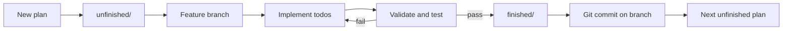

# Implementation plans

Plans for features and refactors. Use this layout when batching work across a single session.

Persistent agent guidance: [`feature-implementation-workflow.md`](feature-implementation-workflow.md) · [`.cursor/rules/plan-workflow.mdc`](../../.cursor/rules/plan-workflow.mdc) (add in agent mode)  
Cluster strategy: `feature_implementation_workflow` (`scope=0`)

## Folders

| Folder | Purpose |
|--------|---------|
| [`unfinished/`](unfinished/) | **All new plans start here.** Not started or in progress — execute in `order` |
| [`finished/`](finished/) | Validated and tested — move here only after the plan checklist passes |

Legacy plans at this directory root (`admin-datasets.md`, `frontend-oidc-auth.md`) predate this layout; treat them as finished reference unless moved into `finished/`.

## Feature implementation workflow

### Steps

1. **Create** — write new plans only under `unfinished/` with `order`, `status`, and `todos` in frontmatter.
2. **Branch** — check out or create a feature branch for the work.
3. **Implement** — complete plan todos; UI work must pass Playwright validation (see `.cursor/rules/ui-playwright-validation.mdc`).
4. **Validate** — run every item in the plan's **Validation** / **Test plan** section. Do not proceed until it passes.
5. **Archive** — move `unfinished/<plan>.md` → `finished/<plan>.md`; set `status: done`, todos `completed`, add **Completed** note; update the queue table below.
6. **Commit** — commit on the feature branch (user must request commit explicitly per project rules). Do not push unless asked.
7. **Repeat** — next lowest `order` in `unfinished/` for batch sessions.

## Unfinished queue

| Order | Plan | Status |
|-------|------|--------|
| 1 | [training-mode-ui.md](unfinished/training-mode-ui.md) | pending |
| 2 | [llm-cost-estimation.md](unfinished/llm-cost-estimation.md) | pending |
| 3 | [authenticated-chat-history.md](unfinished/authenticated-chat-history.md) | pending |
| 3 | [iteration-summary-popovers.md](unfinished/iteration-summary-popovers.md) | pending |
| 3 | [token-usage-chart-clarity.md](unfinished/token-usage-chart-clarity.md) | pending |
