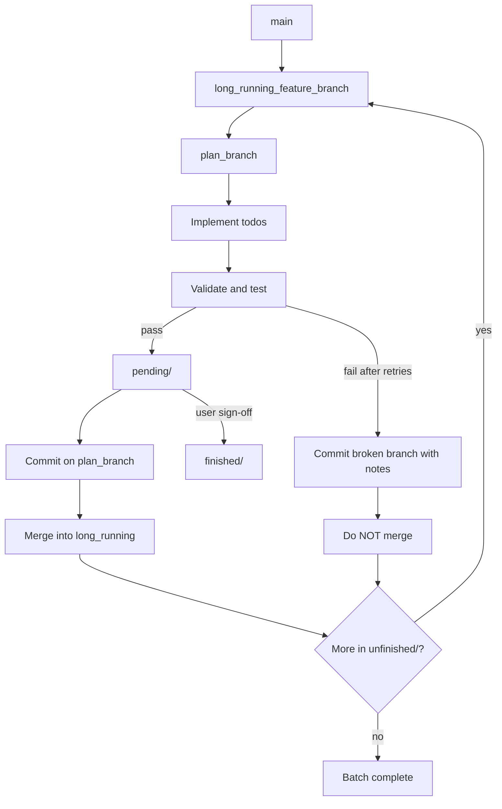

# Implementation plans

Plans for features and refactors. Use this layout when batching work across a single session.

Persistent agent guidance: [`feature-implementation-workflow.md`](feature-implementation-workflow.md) · [`.cursor/rules/plan-workflow.mdc`](../../.cursor/rules/plan-workflow.mdc)  
Cluster strategy: `feature_implementation_workflow` (`scope=0`)

## Folders

| Folder | Purpose |
|--------|---------|
| [`unfinished/`](unfinished/) | **All new plans start here.** Not started, in progress, or blocked after a failed batch attempt — execute in `order` |
| [`pending/`](pending/) | Validated, committed, and merged into the long-running batch branch — awaiting your review |
| [`finished/`](finished/) | You reviewed and signed off |

Legacy plans at this directory root (`admin-datasets.md`, `frontend-oidc-auth.md`) predate this layout; treat them as finished reference unless moved into `finished/`.

## Feature implementation workflow

### Steps

1. **Create** — write new plans only under `unfinished/` with `order`, `status`, and `todos` in frontmatter.
2. **Batch branch** — from `main`, create one long-running feature branch (e.g. `feature/batch-2026-06-28`).
3. **Per plan** — branch from the long-running branch, implement todos, validate (UI → headless Playwright per `.cursor/rules/ui-playwright-validation.mdc`).
4. **On success** — move `unfinished/<plan>.md` → `pending/<plan>.md`; commit on plan branch; merge into long-running branch.
5. **On failure** — after reasonable retries, commit the plan branch with failure notes; do **not** merge; leave plan in `unfinished/` as `blocked`.
6. **Repeat** — next lowest `order` in `unfinished/` (ties: alphabetical filename).
7. **Sign-off** — after review, move `pending/<plan>.md` → `finished/<plan>.md`.

Headless batch sessions: auto-commit and auto-merge are pre-authorized when validation passes. Do not push unless asked.

## Unfinished queue

| Order | Plan | Status |
|-------|------|--------|
| 2 | [llm-cost-estimation.md](unfinished/llm-cost-estimation.md) | pending |
| 3 | [authenticated-chat-history.md](unfinished/authenticated-chat-history.md) | pending |
| 3 | [iteration-summary-popovers.md](unfinished/iteration-summary-popovers.md) | pending |
| 3 | [token-usage-chart-clarity.md](unfinished/token-usage-chart-clarity.md) | pending |
