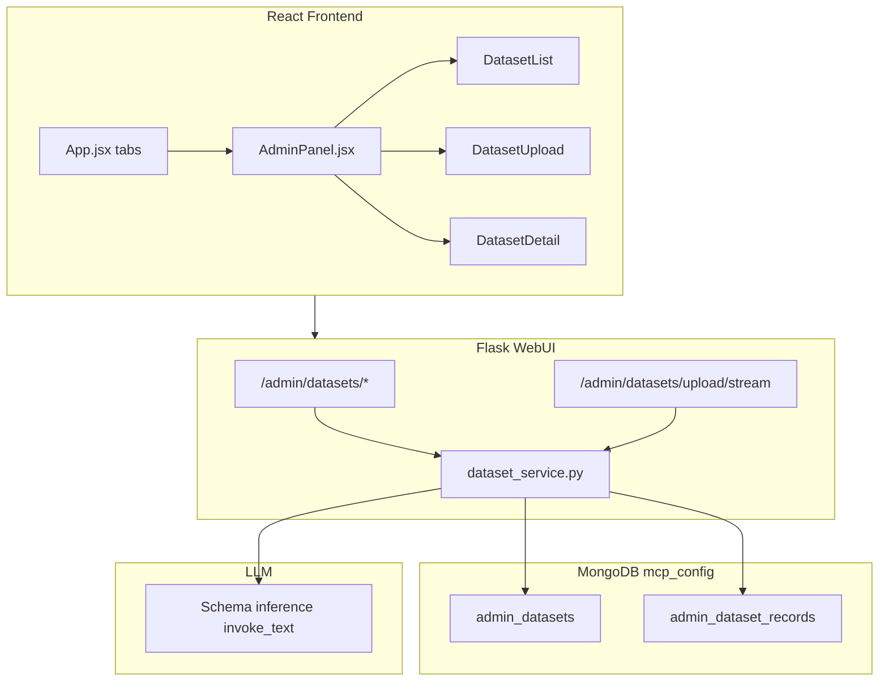

# Admin Datasets Page

## Overview

Add an Admin tab to the existing Web UI with a Datasets sidebar, upload flow (file or free text) that uses LLM-assisted schema inference and chunked MongoDB ingestion, and a paginated dataset detail view with editable markdown display overrides for record owners.

**Branch:** `feature/admin-datasets`

---

## Architecture

---

## Data model (MongoDB)

Store everything in `mcp_config` (consistent with existing platform collections).

### `admin_datasets` (metadata, one doc per dataset)

| Field | Type | Notes |
|-------|------|-------|
| `name` | string | Display name |
| `description` | string | Shown on list card |
| `category` | enum | `growth`, `config`, `personalization` |
| `owner` | string | Username from `mcp_username` cookie at upload time |
| `schema` | object | LLM-inferred field defs: `{fields: [{name, type, description}]}` |
| `record_count` | int | Updated after ingest |
| `created_at` / `updated_at` | datetime | |

Index: `{category: 1}`, `{owner: 1}`

### `admin_dataset_records` (normalized rows, shared collection)

| Field | Type | Notes |
|-------|------|-------|
| `dataset_id` | ObjectId | FK to `admin_datasets._id` |
| `data` | object | Semi-homogeneous normalized fields per dataset |
| `display_markdown` | string \| null | Owner-editable presentation override; `null` = auto-generate from `data` |
| `row_index` | int | Stable ordering for pagination |
| `created_at` | datetime | |

Index: `{dataset_id: 1, row_index: 1}` for efficient `skip/limit` pagination.

**Auto-markdown generation** (server-side helper): iterate `data` keys/values and produce markdown like `**key**: value` with nested objects as bullet lists. Used when `display_markdown` is null.

---

## Backend

### `MongoMCP/webui/dataset_service.py`

1. Parse JSON array, NDJSON, CSV, single object, or free text.
2. LLM schema inference on up to 15 sampled records (chunk-safe).
3. Chunked ingest in batches of 100 with progress callbacks.
4. CRUD: list, get, paginated records, owner-gated markdown patch.

### Flask routes (`MongoMCP/webui/app.py`)

| Method | Path | Purpose |
|--------|------|---------|
| GET | `/admin/datasets` | List datasets |
| POST | `/admin/datasets/upload/stream` | NDJSON streaming upload |
| GET | `/admin/datasets/<id>` | Dataset metadata |
| GET | `/admin/datasets/<id>/records?page=1&limit=10` | Paginated records |
| PATCH | `/admin/datasets/<id>/records/<record_id>` | Save display markdown (owner only) |

---

## Frontend

- **Admin tab** in header (Chat | Admin)
- **`admin/AdminPanel.jsx`** — sidebar with Datasets nav
- **`DatasetList.jsx`** — colored cards by category
- **`DatasetUpload.jsx`** — file + text, progress bar after 1s
- **`DatasetDetail.jsx`** — paginated records (10/page)
- **`RecordCard.jsx`** — rendered markdown, owner Edit → Save

Category colors: growth `#00684A`, config `#006CFA`, personalization `#7B3FF2`.

---

## Out of scope (v1)

- Auth beyond username cookie
- Delete dataset / re-upload
- Registering datasets as MCP search tools
- Vector embeddings on dataset records

---

## Test plan

1. Start Flask + Vite dev; confirm Admin tab appears.
2. Upload small JSON array — verify category card, detail page, markdown rendering.
3. Upload large NDJSON — progress bar after 1s, pagination 10/page.
4. Upload free text — LLM infers schema.
5. As owner: edit record markdown, Save, reload — override persists.
6. As different username: edit hidden, PATCH returns 403.
