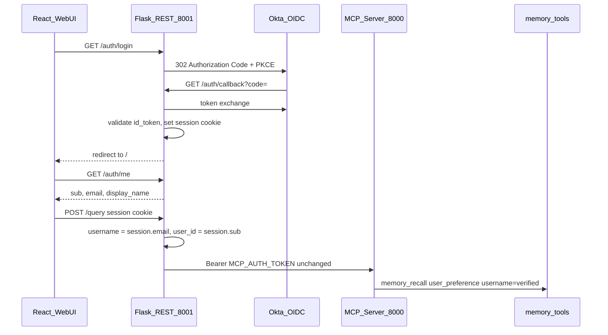

# Frontend OIDC Authentication (Phase 1)

**Branch:** `feature/frontend-oidc-auth`

## Pre-work

1. Create branch `feature/frontend-oidc-auth` from `main`
2. Commit this plan document before implementation commits
3. Implementation follows the rollout steps below

---

## Scope

**In scope now**

- React login UX (Sign in / Sign out, profile display)
- Flask **REST** OIDC flow on the Web UI server (`:8001`) — **not** exposed as MCP tools
- Server-derived `username` / `user_id` injected **only** where memory needs identity (user preferences prefetch)

**Explicitly out of scope for this phase**

- Per-user cluster ACL / Atlas Admin API
- Admin dataset auth, filtering, or discovery changes
- MCP server auth changes (`MCP_AUTH_TOKEN`, `agent_identities`)
- Per-user PyMongo / Workforce DB connections
- `GET /auth/clusters` or any Atlas MCP integration in the app runtime

Cluster-scoped admin discovery remains a **future phase** (see appendix).

---

## Why REST on Flask, not MCP

OIDC Authorization Code + PKCE is a browser redirect flow. It belongs on the Web UI HTTP server:

| Concern | REST (Flask) | MCP |
|---------|--------------|-----|
| Browser redirect to IdP | Natural (`/auth/login` → 302) | Not designed for browser redirects |
| Session cookie after callback | Standard Flask session | N/A |
| Token storage | Server-side session (httpOnly) | Would leak pattern if exposed as tool |

The MCP server continues to handle tools/memory with the existing service JWT. The Web UI authenticates the human, then passes verified identity into chat requests.



---

## Frontend changes

### `MongoMCP/webui/frontend/src/App.jsx`

**Remove**

- `mcp_username` cookie + editable User input + Save button
- `SESSION_GREETING` that announces a self-declared username

**Add**

- On mount: `GET /auth/me` with `credentials: 'include'`
- Header: signed-in email/name + Sign out → `/auth/logout`
- All chat `fetch` calls: `credentials: 'include'`
- `user_id` from `/auth/me` `sub` when logged in

### `AdminPanel`

**No auth changes in this phase.**

---

## Backend changes (minimal)

### New module: `MongoMCP/webui/auth/oidc.py`

- PKCE state generation and validation
- Token exchange with IdP token endpoint
- `id_token` validation (JWKS)
- Flask session read/write helpers

### REST routes on `app.py`

| Route | Auth | Purpose |
|-------|------|---------|
| `GET /auth/login` | public | Start PKCE; redirect to IdP |
| `GET /auth/callback` | public | Exchange code; set session; redirect `/` |
| `GET /auth/logout` | session | Clear session |
| `GET /auth/me` | session | `{sub, email, display_name}` or 401 |

### Memory layer integration

Change in `app.py` only — in `/query` and `/query/stream`: inject `username` / `user_id` from OIDC session for `mcp_processor` memory prefetch.

---

## Environment variables

```
OIDC_ISSUER=...
OIDC_CLIENT_ID=...
OIDC_CLIENT_SECRET=...
OIDC_REDIRECT_URI=http://localhost:8001/auth/callback
OIDC_SCOPES=openid profile email
SESSION_SECRET=...
AUTH_REQUIRED=false
```

---

## Rollout

1. Flask REST auth — routes + session + env vars
2. Memory injection — `/query` + `/query/stream` username from session
3. React login UX — remove cookie editor, add Sign in/out
4. Production — `AUTH_REQUIRED=true`, Secrets Manager, prod redirect URI

---

## Appendix: future phase

Per-user cluster dataset discovery via Atlas Admin API + Workforce OIDC DB connections. Deferred until frontend auth is shipped.
