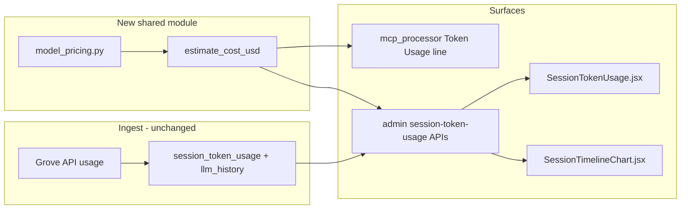

**Completed:** 2026-06-28 — branch `feature/batch-2026-06-28-llm-cost-estimation`

# LLM cost estimation (multi-model ready)

## Goal

Attach **estimated USD cost** to chatbot LLM usage using Anthropic-style per-million-token rates, starting with **Claude Sonnet 4.6**:

| Token type  | Price / 1M |
| ----------- | ---------- |
| Input       | $3.00      |
| Output      | $15.00     |
| Cache read  | $0.30      |
| Cache write | $3.75      |

Design so adding models later is a **registry entry**, not a schema change.

## Architecture



**Compute-at-read (v1):** Do not persist `estimated_cost_usd` in MongoDB. Recompute from stored token counts + `meta.model_id` when serving APIs and emitting chat progress. Benefits: no migration/backfill, new models work on historical rows, price table updates apply retroactively (document as “estimated at current rates”).

## 1. Shared pricing module

**New file:** [`MongoMCP/mongomcp/model_pricing.py`](../../mongomcp/model_pricing.py)

```python
@dataclass(frozen=True)
class ModelPricing:
    input_usd_per_million: float
    output_usd_per_million: float
    cache_read_usd_per_million: float
    cache_write_usd_per_million: float
    display_name: str = ""

MODEL_PRICING: dict[str, ModelPricing] = {
    "claude-sonnet-4-6": ModelPricing(3.0, 15.0, 0.30, 3.75, "Claude Sonnet 4.6"),
    # future models here
}
```

**Helpers:**

- `resolve_model_id(model_id: str) -> str` — reuse same normalization as [`normalize_grove_model_id`](../../mongomcp/grove_anthropic_client.py) (`global.anthropic.` prefix strip)
- `get_model_pricing(model_id: str) -> ModelPricing | None`
- `estimate_cost_usd(*, model_id, input_tokens, output_tokens, cache_read_input_tokens, cache_creation_input_tokens) -> float | None`

**Billing formula** (Anthropic prompt-cache semantics):

```
cost = (input_tokens       * input_rate
      + output_tokens      * output_rate
      + cache_read_tokens  * cache_read_rate
      + cache_write_tokens * cache_write_rate) / 1_000_000
```

Token fields already stored separately in [`session_token_usage_service.py`](../../webui/session_token_usage_service.py) — no double-counting.

**Unknown models:** return `None`; callers show `—` and optionally log once at debug level.

**Tests:** new [`MongoMCP/mongomcp/test_model_pricing.py`](../../mongomcp/test_model_pricing.py) covering normalization, Sonnet 4.6 math, cache-heavy call, and unknown model.

## 2. Backend: enrich API responses

Extend [`session_token_usage_service.py`](../../webui/session_token_usage_service.py):

| Function                     | Add                                                                                                                                                                               |
| ---------------------------- | --------------------------------------------------------------------------------------------------------------------------------------------------------------------------------- |
| `list_session_token_usage`   | `estimated_cost_usd` per record (`row.meta.model_id` + token fields)                                                                                                              |
| `aggregate_token_usage`      | `estimated_cost_usd` per bucket (already grouped by `model_id`)                                                                                                                   |
| `list_recent_sessions`       | Sum `input_tokens`, `output_tokens`, cache fields in `$group` (today only `total_tokens`), then `estimated_cost_usd` per session                                                  |
| `aggregate_session_timeline` | Per-bucket cost: change usage pipeline to `$group` by `{bucket, model_id}`, compute cost per group, then re-group by bucket summing `estimated_cost_usd` into each timeline point |

Also add top-level rollups where cheap:

- `list_session_token_usage` response: `totals.estimated_cost_usd` for **current page** (UI footer)
- `aggregate_token_usage` response: `totals.estimated_cost_usd` across all returned buckets

**Optional transparency endpoint** in [`app.py`](../../webui/app.py):

`GET /admin/model-pricing` → `{ models: [{ id, display_name, rates... }] }` (read-only registry export). Lets the UI show a “rates” footnote without duplicating constants in JS.

No changes to [`record_session_token_usage`](../../webui/session_token_usage_service.py) write path — `model_id` is already in `meta` from [`mcp_processor._persist_session_usage`](../../webui/mcp_processor.py).

## 3. Live chat progress line

In [`mcp_processor.py`](../../webui/mcp_processor.py) (~line 624), after token counts are computed:

```python
cost = estimate_cost_usd(
    model_id=settings.LLM_MODEL_ID,
    input_tokens=in_tok,
    output_tokens=out_tok,
    cache_read_input_tokens=cache_read,
    cache_creation_input_tokens=cache_write,
)
cost_part = f"  est. ${cost:.4f}" if cost is not None else ""
emit_fn(f"Tokens — in: ...{cost_part}  ({pct}% of ...)", status="Token Usage")
```

Use 4 decimal places for sub-cent turns; `$0.0012` style.

## 4. Frontend: Admin Token Usage

[`SessionTokenUsage.jsx`](../../webui/frontend/src/admin/SessionTokenUsage.jsx):

- Add `formatCost(usd)` → `$X.XX` (or `—` for null)
- **Toolbar KPI:** “Estimated spend” for visible summary buckets + note “at current model rates”
- **Usage over time table:** new **Est. cost** column (`row.estimated_cost_usd`)
- **LLM calls table:** new **Model** (`row.meta.model_id`) and **Est. cost** columns
- **Session selector:** extend `formatSessionLabel` to show cost from `sessions[].estimated_cost_usd`
- **History modal:** formatted cost header above raw JSON (compute from `usage` + `model_id` if API doesn’t add it to `llm_history` yet)

Shared helper option: thin [`formatCost.js`](../../webui/frontend/src/admin/formatCost.js) imported by chart + table.

## 5. Timeline chart cost series

[`SessionTimelineChart.jsx`](../../webui/frontend/src/admin/SessionTimelineChart.jsx):

- Add series `{ key: 'estimated_cost_usd', label: 'Est. cost ($)', color: '#eab308', axis: 'cost' }`
- Third Y-axis on the right for USD (scale independently from tokens/events)
- Toggle or legend entry so cost doesn’t clutter default view

Depends on `estimated_cost_usd` in timeline `points` from backend step 2.

## 6. Styling

[`index.css`](../../webui/frontend/src/index.css) — minimal additions:

- `.usage-cost` — monospace, right-aligned
- `.usage-kpi` — toolbar spend summary
- Chart legend/axis label for cost series

## 7. Extensibility contract (future models)

To add a model later:

1. Add entry to `MODEL_PRICING` in `model_pricing.py`
2. Set `LLM_MODEL_ID` / Grove model id to match registry key (or alias via `resolve_model_id`)
3. No DB migration; historical rows with that `meta.model_id` pick up pricing automatically

Future enhancements (out of scope for v1):

- Persist `estimated_cost_usd` + `pricing_version` at write time for audit-grade billing
- Load pricing from env/JSON instead of code
- Per-tenant markup multiplier

## 8. Validation

Per [ui-playwright-validation rule](../../../.cursor/rules/ui-playwright-validation.mdc):

1. Headless Playwright: sign in → Admin → Token Usage
2. Confirm **Est. cost** columns populate for existing usage rows
3. Send a chat message; confirm live **Token Usage** line includes `est. $…`
4. Select a session; confirm timeline shows cost series
5. Screenshot for visual check

## Files touched (summary)

| File                                          | Change                                          |
| --------------------------------------------- | ----------------------------------------------- |
| `mongomcp/model_pricing.py`                   | **New** — registry + calculator                 |
| `mongomcp/test_model_pricing.py`              | **New** — unit tests                            |
| `webui/session_token_usage_service.py`        | Enrich list/summary/sessions/timeline with cost |
| `webui/app.py`                                | Optional `GET /admin/model-pricing`             |
| `webui/mcp_processor.py`                      | Cost in live Token Usage message                |
| `frontend/src/admin/SessionTokenUsage.jsx`    | Cost columns + KPI                              |
| `frontend/src/admin/SessionTimelineChart.jsx` | Cost series + axis                              |
| `frontend/src/index.css`                      | Cost/KPI styles                                 |
