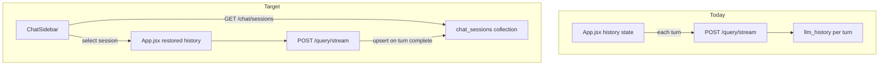

# Authenticated Chat History Plan

## Current state

Today the chat UI is **client-owned**: [`App.jsx`](../../../webui/frontend/src/App.jsx) keeps `history` in React state and sends it on every `/query/stream` call. `sessionId` is a fresh `crypto.randomUUID()` on each page load; nothing restores conversations after refresh.

The backend already **snapshots** each turn to `llm_history` via [`save_llm_history()`](../../../webui/session_token_usage_service.py) in [`_persist_session_usage()`](../../../webui/mcp_processor.py) — but that is audit/telemetry only (admin JSON viewer), not a user-facing session store.



**Scope decisions (confirmed):**

- **Forward-only** — no backfill from existing `llm_history` rows
- **No delete** in v1 — list + resume only
- **Authenticated users only** — keyed on OIDC `sub` (`user_id`); anonymous users keep current ephemeral behavior

---

## Data model: `chat_sessions` collection

New collection in `mcp_config` (same DB as `llm_history`).

| Field | Type | Purpose |
|-------|------|---------|
| `session_id` | string (UUID) | Same ID the frontend sends to `/query/stream` |
| `user_id` | string | OIDC `sub` — ownership |
| `username` | string | Email (for debugging/admin parity) |
| `title` | string | Auto from first user message (~60 chars) |
| `history` | array | Latest full Grove message array (source of truth for restore) |
| `turn_extras` | array (optional) | Per-turn `{ mapData }` for chart/map fidelity |
| `message_count` | int | Turn count for sidebar subtitle |
| `created_at` | datetime UTC | First message |
| `updated_at` | datetime UTC | Last completed turn — **sidebar sort + date grouping** |

**Indexes:**

- Unique: `{ user_id: 1, session_id: 1 }`
- List: `{ user_id: 1, updated_at: -1 }`

`llm_history` stays unchanged as per-turn audit; `chat_sessions` is the **canonical UI store**.

---

## Restore fidelity (“see the same results”)

| UI element | Restore strategy |
|------------|------------------|
| User/assistant text, tool calls | From stored `history` via existing `parseHistoryToTurns()` |
| Maps/charts (`mapData`) | Re-parse `[JSON_DATA_START]…[JSON_DATA_END]` from each turn’s raw assistant text in `history` (same logic as [`webui_grove_client.py`](../../../mongomcp/agent/webui_grove_client.py)); optionally also persist `turn_extras[].mapData` on save for redundancy |
| Reasoning step tiles | **Not persisted** in v1 (streaming diagnostics only); tool results and final answers are preserved |
| Continue chatting | Set `sessionId` + `history` from loaded session; next `/query/stream` appends as today |

---

## Backend

### New service: [`chat_session_service.py`](../../../webui/chat_session_service.py)

Functions (mirror patterns in [`user_memory_service.py`](../../../webui/user_memory_service.py) / [`session_token_usage_service.py`](../../../webui/session_token_usage_service.py)):

- `upsert_chat_session(user_id, username, session_id, history, *, jsondata=None)` — upsert on each completed turn; derive `title` from first user turn if new; bump `updated_at`
- `list_chat_sessions(user_id, *, limit=100)` — lightweight rows: `session_id`, `title`, `updated_at`, `message_count`
- `get_chat_session(user_id, session_id)` — full doc for restore; **403 if `user_id` mismatch**
- `create_chat_session(user_id, username)` — insert empty session with new UUID (for “New chat”)

Helper: `_title_from_history(history)` — first user text, truncated.

Helper: `_extract_turn_map_data(history)` — build `turn_extras` array aligned with `parseHistoryToTurns` indices.

### Hook into existing query flow

In [`APIQueryProcessor._persist_session_usage()`](../../../webui/mcp_processor.py) (line ~655), after `save_llm_history`:

```python
if request.user_id and request.session_id and history:
    upsert_chat_session(
        user_id=request.user_id,
        username=request.username,
        session_id=request.session_id,
        history=history,
        jsondata=jsondata,
    )
```

Only runs when OIDC identity is present (already enforced when `AUTH_REQUIRED=true`).

### New routes in [`app.py`](../../../webui/app.py)

All require `get_user_from_session()` — return 401 if absent.

| Method | Path | Behavior |
|--------|------|----------|
| `GET` | `/chat/sessions` | List current user’s sessions (sorted `updated_at` desc) |
| `GET` | `/chat/sessions/<session_id>` | Full session for restore |
| `POST` | `/chat/sessions` | Create empty session; return `{ session_id }` |

No delete endpoint in v1.

---

## Frontend

### Layout change in [`App.jsx`](../../../webui/frontend/src/App.jsx)

When `authUser` is set and `activeTab === 'chat'`, wrap body+footer in a flex row mirroring admin:

```
chat-root (column: header + content)
  chat-layout (flex row, flex 1)          ← new, like .admin-layout
    ChatSidebar                           ← new
    chat-main (column: chat-body + chat-footer)
```

Reuse existing BEM tokens from [`index.css`](../../../webui/frontend/src/index.css) (`.admin-sidebar`, `.admin-sidebar__item`, `.admin-sidebar__item--active`) — add `.chat-layout` / `.chat-sidebar` variants (sidebar can be ~220px for titles).

### New component: [`ChatSidebar.jsx`](../../../webui/frontend/src/ChatSidebar.jsx)

**Props:** `activeSessionId`, `onSelectSession`, `onNewChat`, `refreshKey`

**Behavior:**

1. `GET /chat/sessions` on mount and when `refreshKey` changes (increment after each completed stream)
2. Group sessions by `updated_at` into buckets:
   - **Today**
   - **Yesterday**
   - **Previous 7 days**
   - **Older** (group by month label, e.g. “June 2026”)
3. Render section headers + clickable items (title + optional turn count)
4. **+ New chat** button at top → calls `onNewChat`
5. Highlight active session (green left border, same as admin nav)

Date grouping utility: `groupSessionsByDate(sessions)` in a small `chatSessionUtils.js`.

### `App.jsx` state wiring

| Event | Action |
|-------|--------|
| Mount (authenticated) | Fetch session list; optionally auto-select most recent session **or** start blank new session (recommend: **blank new session** on load, sidebar shows history for manual resume — avoids surprising users with old chat on every visit) |
| **New chat** / **Clear chat** | `POST /chat/sessions` → set new `sessionId`, clear `history`/refs (replace current `clearHistory()` UUID-only behavior) |
| Stream completes | Bump `sidebarRefreshKey` |
| Sidebar click | `GET /chat/sessions/:id` → set `sessionId`, `history`, rebuild `allMapDataRef` from `turn_extras` or re-parsed JSON blocks |
| Submit question | Unchanged — sends current `sessionId` + `history` |

Extract shared helper `extractJsonDataBlock(text)` (mirror `App.jsx` strip logic) for restore-time map hydration.

### CSS additions in [`index.css`](../../../webui/frontend/src/index.css)

- `.chat-layout` — `display: flex; flex: 1; min-height: 0; overflow: hidden`
- `.chat-sidebar` — extend `.admin-sidebar` (wider if needed for titles)
- `.chat-sidebar__group-label` — muted date section headers (12px, uppercase or semibold)
- `.chat-sidebar__item` — truncate long titles with `text-overflow: ellipsis`
- `.chat-main` — `flex: 1; display: flex; flex-direction: column; min-width: 0`

---

## Auth and security

- All `/chat/sessions*` routes scoped to `session.sub` from Flask OIDC session ([`oidc.py`](../../../webui/auth/oidc.py))
- `get_chat_session` verifies `doc.user_id == session.sub` before returning `history`
- Sidebar hidden when not signed in; persistence skipped when `request.user_id` is absent
- `credentials: 'include'` on all fetches (already in `FETCH_OPTS`)

---

## Testing / validation

1. **Backend:** unit-style test of `upsert_chat_session` title derivation + ownership check (if test harness exists); manual curl with session cookie
2. **UI (Playwright headless, per workspace rule):**
   - Sign in → send message → refresh page → session appears in sidebar grouped under Today
   - Click session → prior turns render (text + tools)
   - Send follow-up in resumed session → `updated_at` moves session to top of Today
   - New chat → empty pane, new sidebar entry after first message

---

## File touch list

| File | Change |
|------|--------|
| [`chat_session_service.py`](../../../webui/chat_session_service.py) | **New** — CRUD + upsert |
| [`app.py`](../../../webui/app.py) | 3 routes + import |
| [`mcp_processor.py`](../../../webui/mcp_processor.py) | Call upsert after turn |
| [`ChatSidebar.jsx`](../../../webui/frontend/src/ChatSidebar.jsx) | **New** — sidebar UI |
| [`chatSessionUtils.js`](../../../webui/frontend/src/chatSessionUtils.js) | **New** — date grouping + JSON block extract |
| [`App.jsx`](../../../webui/frontend/src/App.jsx) | Layout, load/resume, refresh sidebar |
| [`index.css`](../../../webui/frontend/src/index.css) | Chat sidebar styles |

---

## Out of scope (v1)

- Backfill from `llm_history`
- Delete/rename chats
- Persisting reasoning-step streaming tiles
- URL deep-linking (`?session=…`) — easy follow-up
- Pagination for users with 100+ chats
