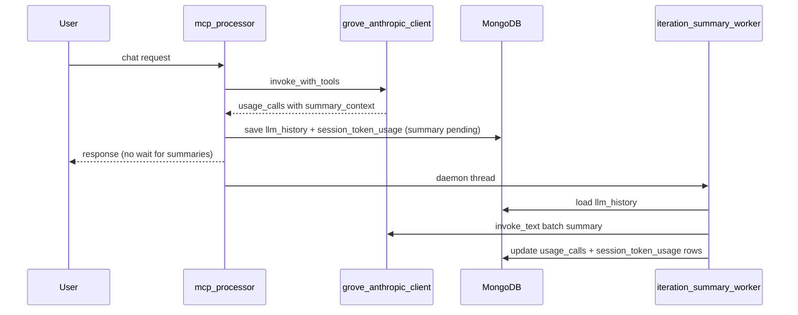

# Async LLM iteration summaries on Token Usage

## Goal

Each row in the **LLM calls** table represents one Grove tool-loop iteration. Add a short LLM-generated description of what that iteration did, without widening the table: a compact **"summary"** link that shows the full text in a **floating popover** on hover (click/tap fallback).

## Current state

- Iterations are recorded in [`grove_anthropic_client.py`](../../../mongomcp/grove_anthropic_client.py) as `usage_calls[]` (metrics only).
- [`record_session_token_usage()`](../../../webui/session_token_usage_service.py) fans each call into `session_token_usage` rows keyed by `llm_history_id` + `iteration`.
- [`SessionTokenUsage.jsx`](../../../webui/frontend/src/admin/SessionTokenUsage.jsx) renders the table; no summary fields exist today.



## Backend design

### 1. Capture per-iteration context at call time (sync, cheap)

In [`grove_anthropic_client.py`](../../../mongomcp/grove_anthropic_client.py), after each Grove response and **before** tool execution, enrich `call_record` with a small `summary_context` object (not shown in UI directly):

- `assistant_text` — joined text blocks, truncated (~1–2k chars)
- `tools` — list of `{name, input}` with inputs JSON-truncated (e.g. 300 chars per tool)
- `is_final` — `true` when the iteration has no `tool_use` blocks (final answer iteration)

Error iterations get `summary_context: { error: str(e) }`.

This rides along in `usage_calls` inside `llm_history` via existing [`save_llm_history()`](../../../webui/session_token_usage_service.py).

### 2. Persist summary placeholders on usage rows

Extend [`record_session_token_usage()`](../../../webui/session_token_usage_service.py) to write on each row:

| Field | Initial value |
|-------|---------------|
| `summary` | `null` |
| `summary_status` | `"pending"` when `llm_history_id` present, else `"skipped"` |

Extend [`list_session_token_usage()`](../../../webui/session_token_usage_service.py) to return `summary` and `summary_status` on each record.

### 3. New async summarization service

Add [`iteration_summary_service.py`](../../../webui/iteration_summary_service.py):

- **`enqueue_turn_summaries(llm_history_id: str)`** — spawn `threading.Thread(..., daemon=True)` (same pattern as [`app.py`](../../../webui/app.py) background threads). No blocking of the chat response.
- **`summarize_turn(llm_history_id)`** (runs in thread via `asyncio.run`):
  1. Load `llm_history` doc.
  2. Skip if all `usage_calls` already have `summary_status == "ready"` (idempotent).
  3. Build **one batched prompt** for all iterations (single `invoke_text` call per turn — lower cost/latency than N calls):

```
User message: …
For each LLM iteration below, write one concise sentence (max ~200 chars) describing what that call did (reasoning, tools invoked, or final answer).

Iteration 1 (intermediate): assistant text …; tools: memory_recall(…)
Iteration 2 (final): assistant text …

Return JSON only: {"1": "…", "2": "…"}
```

  4. Parse JSON safely; on parse failure, fall back to one sentence per iteration in a second minimal retry or mark `failed`.
  5. **Update MongoDB atomically per iteration:**
     - `llm_history.usage_calls.$[i].summary` + `summary_status: "ready"`
     - `session_token_usage` where `{ llm_history_id, iteration }` → `{ summary, summary_status: "ready" }`
  6. On exception → set `summary_status: "failed"` on affected rows (store short `summary_error` if useful).

Use existing [`GroveAnthropicClient.invoke_text`](../../../mongomcp/grove_anthropic_client.py) with low `max_tokens` (~512 for the whole batch). Reuse `settings` / model already configured for webui.

### 4. Trigger after persistence

In [`mcp_processor._persist_session_usage()`](../../../webui/mcp_processor.py), after successful `save_llm_history` + `record_session_token_usage`, call `enqueue_turn_summaries(llm_history_id)` when `llm_history_id` is set and there is at least one usage call with `summary_context`.

**Existing rows:** no backfill in v1; they remain `summary_status: skipped` or absent → UI shows no link.

## Frontend design

### 1. Popover component (in [`SessionTokenUsage.jsx`](../../../webui/frontend/src/admin/SessionTokenUsage.jsx) or small sibling file)

- **`IterationSummaryPopover`** — trigger is a `btn-link` labeled e.g. **"summary"** (only when `summary_status` is `ready` or `pending`).
- **Hover:** `mouseenter` on trigger shows a fixed/absolute card near the trigger (`getBoundingClientRect`), with ~300ms show delay and hide delay so the cursor can move into the popover.
- **Click/tap:** toggle open (accessibility + mobile).
- **Escape / outside click:** close.
- **Content by status:**
  - `ready` → full `summary` text (wrap, max-width ~360px)
  - `pending` → "Generating summary…"
  - `failed` → "Summary unavailable" (+ optional error tooltip)
  - missing → no trigger (keeps table clean)

### 2. Table change (minimal width impact)

Add a narrow **Summary** column after **Iter** (header ~60px) containing only the link — never the summary body.

```jsx
<td>
  {row.summary_status === 'ready' || row.summary_status === 'pending' ? (
    <IterationSummaryPopover summary={row.summary} status={row.summary_status} />
  ) : '—'}
</td>
```

### 3. Styles in [`index.css`](../../../webui/frontend/src/index.css)

New classes alongside existing `.usage-modal*`:

- `.usage-summary-popover` — white card, shadow, border-radius, z-index above table
- `.usage-summary-popover__body` — readable 13px text, `max-width: 360px`
- `.usage-summary-trigger` — reuse `.btn-link` sizing

No new npm dependencies.

## Validation (per workspace rule)

After implementation, validate with Playwright headless:

1. Dev-login → Token Usage tab
2. Send a chat message (or use existing data) so new rows appear
3. Wait briefly / refresh until `summary_status` becomes `ready`
4. Hover **summary** link → popover shows text; screenshot confirms layout unchanged
5. Confirm table columns still align on a page with multiple iterations

## Files to touch

| File | Change |
|------|--------|
| [`grove_anthropic_client.py`](../../../mongomcp/grove_anthropic_client.py) | Add `summary_context` to `call_record` |
| [`session_token_usage_service.py`](../../../webui/session_token_usage_service.py) | `summary` / `summary_status` on write + list |
| [`iteration_summary_service.py`](../../../webui/iteration_summary_service.py) | **New** — async batch summarization + DB updates |
| [`mcp_processor.py`](../../../webui/mcp_processor.py) | Enqueue after `_persist_session_usage` |
| [`SessionTokenUsage.jsx`](../../../webui/frontend/src/admin/SessionTokenUsage.jsx) | Summary column + popover |
| [`index.css`](../../../webui/frontend/src/index.css) | Popover styles |

## Out of scope (v1)

- Backfilling summaries for historical `session_token_usage` rows
- Polling/WebSocket for live `pending → ready` updates (user can refresh; optional later: auto-refresh interval while any row is `pending`)
- OpenAI client `usage_calls` parity (Grove-only today)
