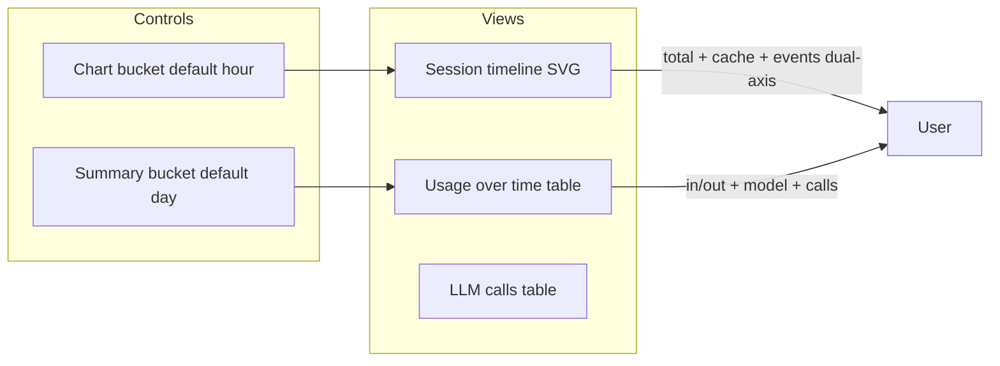

# Token Usage Page Clarity

## Problems today

1. **Mismatched buckets** — [`SessionTokenUsage.jsx`](../../webui/frontend/src/admin/SessionTokenUsage.jsx) uses two independent dropdowns (`bucket` default `day`, `timelineBucket` default `hour`), so the chart and summary table rarely show the same periods.
2. **Overlapping X labels** — [`SessionTimelineChart.jsx`](../../webui/frontend/src/admin/SessionTimelineChart.jsx) renders a full datetime label at every bucket with no thinning or rotation; dense data overlaps.
3. **Chart vs table column mismatch** — Chart plots `total_tokens` + cache + events; tables use **In tokens**, **Out tokens**, **Cache read**, **Cache write**, **Total**, plus **Calls/Errors/Latency/Model** (summary) and per-call rows. Timeline API already returns `input_tokens`, `output_tokens`, `llm_calls` but the chart ignores them.
4. **Confusing dual-axis** — Token counts (thousands) and event counts (single digits) share one SVG with left/right Y axes; bars and lines compete visually.

## Approach (single chart + matching table)

Keep one combined chart per your preference, but make the table the source of truth and tighten chart/table alignment.

### 1. Unify filters

In [`SessionTokenUsage.jsx`](../../webui/frontend/src/admin/SessionTokenUsage.jsx):

- Remove the separate **Chart bucket** dropdown; use one **Time bucket** (`hour` / `day` / `month`) for both `/admin/session-timeline` and `/admin/session-token-usage/summary`.
- Pass the same `session_id` and bucket to both APIs (already partially wired).

### 2. Align series and labels everywhere

Shared label map (chart legend, timeline table headers, tooltips):

| API field | Display label |
|-----------|---------------|
| `input_tokens` | In tokens |
| `output_tokens` | Out tokens |
| `cache_read_input_tokens` | Cache read |
| `cache_creation_input_tokens` | Cache write |
| `total_tokens` | Total |
| `llm_calls` | LLM calls |
| `strategy_store` | Strategy save |
| `strategy_recall` | Strategy use |
| `tool_cache_hit` | Tool cache hit |

Update [`SessionTimelineChart.jsx`](../../webui/frontend/src/admin/SessionTimelineChart.jsx) to plot **In** and **Out** lines (drop redundant `total` line, or keep Total as a faint dashed line). Keep event series on the right axis with a clearer subtitle: **"Activity (count)"**.

### 3. Fix overlapping chart labels

In `SessionTimelineChart.jsx`:

- Increase bottom padding (`pad.bottom` ~72) and rotate X labels **-40°** with `textAnchor="end"`.
- **Thin labels**: show at most ~8 ticks (every `ceil(n/8)` bucket); full period still visible on hover/table.
- Add `title` on each X tick with full `formatTs(bucket)` for accessibility.
- Slightly increase SVG height (~320px) so rotated labels do not clip.

### 4. Add timeline breakdown table (mirrors chart)

Directly under the chart in `SessionTokenUsage.jsx`, render a new table from `timeline.points` (same data as the chart — no second API):

| Period | In tokens | Out tokens | Cache read | Cache write | Total | LLM calls | Strategy save | Strategy use | Tool cache hit |

- Sort chronologically (oldest first) so it reads left-to-right like the chart.
- Reuse existing `usage-table` styles from [`index.css`](../../webui/frontend/src/index.css).
- Empty cells show `0` or `—` consistently with the per-call table.

### 5. Clarify the existing summary table

Rename **Usage over time** → **Usage by model** with subtitle: *"Same time buckets as the chart, split by model."*

This explains why row counts differ from the timeline table (model dimension + errors/latency columns stay here only).

### 6. Light CSS polish

In `index.css`:

- Separate token vs activity legend into two rows (`session-timeline__legend--tokens`, `--activity`).
- Right-axis labels: suffix `(count)` on tick values.
- Ensure chart container has `overflow-x: auto` for many buckets on narrow screens.

## Files to change

| File | Change |
|------|--------|
| [`SessionTokenUsage.jsx`](../../webui/frontend/src/admin/SessionTokenUsage.jsx) | Single bucket state; timeline breakdown table; rename summary section |
| [`SessionTimelineChart.jsx`](../../webui/frontend/src/admin/SessionTimelineChart.jsx) | In/Out series, label thinning + rotation, clearer dual-axis |
| [`index.css`](../../webui/frontend/src/index.css) | Legend layout, rotated label styles |

**No backend changes required** — `aggregate_session_timeline` already exposes all needed fields.

## Validation

- Rebuild frontend (`npm run build`).
- Headless Playwright: Admin → Token Usage, select a session with data, screenshot chart + both tables.
- Confirm chart legend labels match timeline table headers and summary table token column names.
