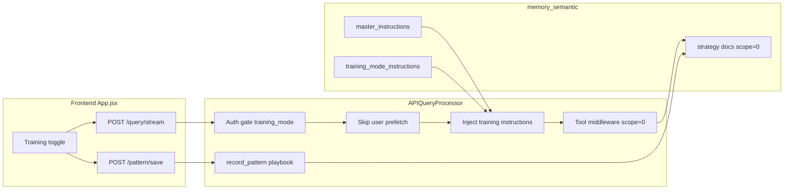

# Training Mode UI Plan

## Context

The codebase already has the primitives for org-wide strategies but no "training mode" concept:

| Concept | Today | Training mode target |
|---------|-------|---------------------|
| Strategy visibility | `scope=0` = shared/org-wide in [`scope.py`](../../../mongomcp/memory/scope.py) | Force `scope=0` on writes |
| Default strategy scope | `scope=30` (user_session) in [`strategy_store`](../../../mongomcp/memory/memservice.py) | Override to `0` |
| Org blueprint | `master_instructions` strategy loaded at startup | Reuse pattern; add `training_mode_instructions` |
| Personalization | `_prefetch_session_context` injects `user_preference` + recent sessions in [`mcp_processor.py`](../../../webui/mcp_processor.py) | Skip when training |
| Save pattern | LLM-mediated `pattern:query` via [`save_pattern`](../../../webui/mcp_processor.py) | Use `ToolRouter.record_pattern` → `strategy_store` with `scope=0` |
| Auto-learning | `CachedQueryProcessor` + `ToolRouter` (not wired in webui) | Wire playbook save for training-mode pattern button |



## User-facing behavior

**Toggle placement:** Chat header in [`App.jsx`](../../../webui/frontend/src/App.jsx), right of the tab bar (segmented-button style matching existing `tab-bar__btn` / `json-viewer__mode` patterns in [`index.css`](../../../webui/frontend/src/index.css)).

**Availability:**

- Enabled only when `authUser` is set (signed in)
- When `authRequired` is false, training mode stays off/disabled (anonymous `demo-user` cannot train)
- Persist preference in `localStorage` key `mcp_training_mode` (restore on reload if still signed in)

**Visual affordances:**

- Active state: header badge/banner — e.g. "Training mode — strategies apply to all users"
- Chat footer "Save pattern" label becomes "Save org strategy" when training mode is on
- Optional subtle border tint on chat body when active

## API contract

Extend [`QueryRequest`](../../../webui/mcp_processor.py):

```python
training_mode: bool = False
```

Pass from frontend on:

- `POST /query/stream` — `{ input, history, session_id, training_mode }`
- `POST /pattern/save` — same field
- `POST /feedback` — same field (positive feedback in training mode should also produce org strategies)

**Auth gate** in [`app.py`](../../../webui/app.py) `generate()` / route handlers:

- If `training_mode=True` and no OIDC session → `401` with clear error
- Do not trust client username; use server-resolved identity for attribution only

## Backend behavior when `training_mode=True`

### 1. Skip personalization prefetch

In `APIQueryProcessor.query_with_mcp_tools`, guard the `_prefetch_session_context` block:

```python
if is_new_session and prefetch_name and not _ctx_prefetched and not request.training_mode:
```

This prevents injecting per-user preferences and recent session summaries that would bias the agent toward individual behavior.

### 2. Inject training-mode system prompt

At processor init (alongside existing `master_instructions` / `dynamicmcp_webui_instructions` load in `_discover_tools`), also attempt to load a cluster strategy named **`training_mode_instructions`** (`scope=0`).

When `request.training_mode` is true, append a runtime system block (DB content if present, else a built-in fallback):

> You are in **Training mode**. The user speaks on behalf of the entire organization. All strategies and playbooks you create must be generalized for all users — use typed placeholders for PII, never store user_preference memories. When calling `memory_strategy_store`, always use `scope=0` (shared).

Also load this strategy in normal mode? **No** — only inject when toggle is on, to avoid changing default chat behavior.

### 3. Server-side enforcement on strategy writes (critical)

Do not rely on the LLM to pass `scope=0`. In `_call_mcp_tool`, when `self._training_mode` is active and tool is `memory_strategy_store`:

- Force `scope: 0`
- Omit or clear `session_id` from tool args (provenance only; optional: keep `username` as trainer attribution in doc metadata)
- Rename kwarg fix: ensure `context` is used (today [`tool_router.py`](../../../mongomcp/agent/tool_router.py) incorrectly passes `description=` — fix while touching this file)

Store `self._training_mode = request.training_mode` alongside existing `_current_session_id` / `_current_username`.

### 4. Refactor Save pattern for training mode

Replace the current LLM-prompt-based [`save_pattern`](../../../webui/mcp_processor.py) for training mode:

**Current (keep for normal mode):**

```python
# LLM stores pattern:query via memory_intake
```

**Training mode (new path):**

1. Stash last query state during `query_with_mcp_tools` (question, answer, history, tool calls) — mirror what `CachedQueryProcessor` does with `_last_question` / `_last_answer`
2. On `/pattern/save` with `training_mode=True`, call `ToolRouter.record_pattern(...)` then pass `scope=0` into the underlying `strategy_store` call
3. Fix `record_pattern` / `route_via_llm` to accept and forward `scope`, `username` (trainer attribution)

This aligns with the existing PII-stripping playbook prompt in `ToolRouter.record_pattern` — already designed for org-wide reusable playbooks.

### 5. Positive feedback in training mode

Update `record_feedback` positive path: when `training_mode=True`, trigger the same `record_pattern` flow instead of the `pattern:query` intake prompt.

## Cluster seed data

Add a one-time seed (script or admin doc) for `training_mode_instructions` in `memory_semantic`:

| Field | Value |
|-------|-------|
| `strategy_key` | `training_mode_instructions` |
| `scope` | `0` |
| `memory_type` | `strategy` |
| `importance` | `0.98` |
| `content` | Org-wide training rules: generalize queries, use placeholders, prefer `strategy_store` over episodic intake, speak for all users |

This mirrors how [`master_instructions`](../../../mongomcp/agent/cached_query_processor.py) is documented as the shared Agent Blueprint. If the strategy is absent, the built-in fallback prompt covers v1.

**Optional follow-up (out of scope for v1):** Admin UI to edit `training_mode_instructions` via existing User Memory admin panel.

## Files to change

| File | Change |
|------|--------|
| [`App.jsx`](../../../webui/frontend/src/App.jsx) | Toggle state, localStorage, banner, pass `training_mode` on API calls, gate on `authUser` |
| [`index.css`](../../../webui/frontend/src/index.css) | `.training-mode-toggle`, `.training-mode-banner` styles |
| [`mcp_processor.py`](../../../webui/mcp_processor.py) | `QueryRequest.training_mode`, skip prefetch, inject prompt, tool middleware, stash last turn, refactor `save_pattern` / `record_feedback` |
| [`app.py`](../../../webui/app.py) | Auth gate for `training_mode`, pass flag to processor |
| [`tool_router.py`](../../../mongomcp/agent/tool_router.py) | Fix `description` → `context`; add `scope` param to `record_pattern` / auto-save paths |
| New: `MongoMCP/scripts/seed_training_mode_instructions.py` (or similar) | Idempotent seed for cluster strategy doc |

## Out of scope (v1)

- **Admin role gate** — any signed-in user can train (per your choice); no RBAC yet
- **strategy_recall scope filtering** — recall is already global; no change needed for training reads
- **Wiring full `CachedQueryProcessor` / AI tool routing into webui** — only the playbook-save path is reused
- **Changing normal-mode save_pattern** — stays LLM-mediated `pattern:query` unless you want to unify later

## Validation

Per [`.cursor/rules/ui-playwright-validation.mdc`](../../../../.cursor/rules/ui-playwright-validation.mdc):

1. Sign in (or confirm auth state)
2. Enable training toggle — verify banner appears
3. Run a query that triggers `memory_strategy_store` (or use Save org strategy)
4. Confirm via admin User Memory or API that new strategy has `scope: 0`
5. Toggle off — confirm user-preference prefetch resumes on new session
6. Screenshot for visual confirmation

## Risks and mitigations

| Risk | Mitigation |
|------|------------|
| LLM ignores scope instruction | Server-side override in `_call_mcp_tool` |
| `description` kwarg bug breaks auto-save | Fix in `tool_router.py` as part of this work |
| Unsigned users confused by disabled toggle | Tooltip: "Sign in to train org-wide strategies" |
| Overwriting shared strategies | `strategy_store` already versions by `strategy_key`; document that training saves create new versions |
