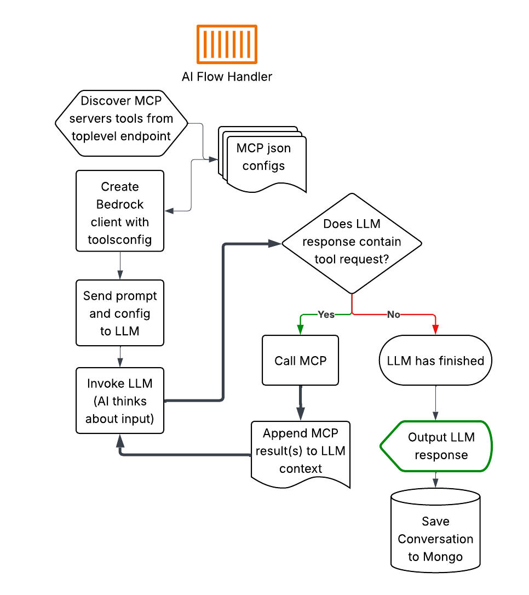

# MCP Client

Example Model Context Protocol (MCP) clients that connect to a MongoDB Atlas vector search MCP server and AWS Bedrock to process user queries using Claude LLM with tool support.



## Available Clients

### 1. `mcp_client.py` - Enhanced Client with Caching (Recommended)

The enhanced client provides caching support, multi-MCP server capabilities, and Token authentication.
Use this with the [MongoMCP](../MongoMCP) server.
You will need a matching Auth token in the MCP_Config.agent_identities and the settings.py

**Key Features:**
- **Multi-MCP Server Support**: Can connect to and use tools from multiple MCP servers simultaneously
- **Dynamic Tool Discovery**: Automatically discovers available MCP tools from root endpoint of the MCP deployment
- **Bearer Token Authentication**: Exmple token system for authenticationg endpoints and MCP tools with clients

**Usage:**
```bash
source bin/activate
aws sso login
python mcp_client.py
```


### 1. `airbnb_mcp_cached.py` - Enhanced Client with Caching (previous version)

The enhanced client provides comprehensive caching support and multi-MCP server capabilities.
Use this with the [dynamicmcp](../dynamicmcp) server.

**Key Features:**
- **Multi-MCP Server Support**: Can connect to and use tools from multiple MCP servers simultaneously
- **Caching System**: Implements multi-level caching including:
  - Bedrock message caching with smart cache point management
  - MCP tool discovery caching
  - Tool response caching with configurable TTL
  - Conversation history caching
- **Smart Cache Management**: Automatically manages Bedrock's 4 cache block limit

**Usage:**
```bash
python airbnb_mcp_cached.py
```

**Interactive Commands:**
- `clear` - Clear conversation history and all caches
- `cache stats` - Show detailed cache statistics
- `cache clear` - Clear all caches while keeping conversation history
- `<question>` - Ask Claude with full MCP tool support and caching

### 2. `airbnb-mcp.py` - Basic Client

A simpler client implementation without caching features.
Use this with the [searchmcp](../searchmcp) server.

## Python Setup Instructions

### Prerequisites
- Python 3.8 or higher
- AWS credentials configured (for Bedrock access)
- Access to a custom MCP server with MongoDB vector search capabilities

### 1. Create Python Virtual Environment

```bash
# Create a new virtual environment
python -m venv .

# Activate the virtual environment
source venv/bin/activate
```

### 2. Install Dependencies

```bash
# Install required packages
pip install -r requirements.txt
```

### 3. Configuration

Before running the application, you need to configure your settings:

1. Copy or create a `settingsairbnb.py` file with your configuration:
   - AWS region settings
   - MongoDB MCP server connection details
      mongo_mcp is for the basic client, mongo_mcp_root is for the dynamic multi-mcp endpoint system.
   - Bedrock model ID

Example `settingsairbnb.py`:
```python
# AWS Configuration
aws_region = "us-east-1"
LLM_MODEL_ID = "anthropic.claude-3-sonnet-20240229-v1:0"

# MCP Server Configuration
mong_mcp = "http://localhost:8000/mcp/"
mongo_mcp_root = "http://localhost:8000"
```

### 4. Run the Application

```bash
python airbnb-mcp.py
```

## Usage

Once the application is running, you can:

- Enter questions directly to query Claude with MCP tool support
- Use `clear` command to clear conversation history and tools
- Press Ctrl+C to exit

## Features

- **MCP Tool Integration**: Automatically discovers and uses tools from connected MCP servers
- **AWS Bedrock Integration**: Uses Claude LLM via AWS Bedrock Converse API
- **Conversation History**: Maintains context across multiple queries


## Troubleshooting

- Ensure your AWS credentials are properly configured
- Verify your MCP server is running and accessible
- Make sure you have the necessary AWS Bedrock model access permissions
- Make sure to use the Cross-region inference profile ID for the given model.
https://docs.aws.amazon.com/bedrock/latest/userguide/cross-region-inference.html?icmpid=docs_bedrock_help_panel_cross_region_inference
